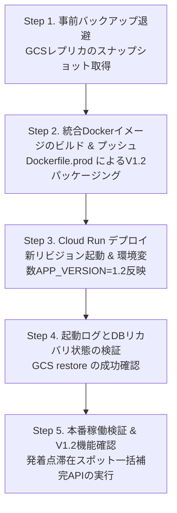

# V1.2 本番適用計画書 (docs/plans/V1.2デプロイ計画.md)

## 1. 計画概要と目的

本ドキュメントは、「自転車走行・滞在記録システム (bicycle-log)」のバージョン **1.2** における改定成果物を Google Cloud Run（本番環境）へ安全かつ確実にデプロイ・適用するための作業計画書である。

本デプロイ計画は、以下の2点を最重要方針として策定されている：

1. **変更されたプログラムコードのみを本番へデプロイすること**
   - フロントエンド（React / Vite SPA）、バックエンド（FastAPI）、および最新の設定を含む統合 Docker イメージを本番環境へ反映する。
2. **データベースは Cloud Run (Litestream / GCS) の現況データを完全維持し、ローカルからのアップロードは行わないこと**
   - 本番で稼働・蓄積されている SQLite データベース（GCSバケット `gs://leopandaaiplayground-bicycle-log-litestream-backend/db/` 上のレプリカおよび Cloud Run 上の実データ）をそのまま維持する。
   - ローカルの `data/app.db` のアップロードや、GCS 上の Litestream バックアップのクリーンアップは**絶対に実行しない**。
   - V1.2 ではテーブル定義の破壊的変更（ALTER TABLE / カラム削除など）は無く、既存の `places` / `stay_logs` テーブル構造を活用しているため、既存データとの完全な後方互換性が保たれている。

---

## 2. 本番環境の現況と適用対象

### 2.1 システム構成・リソース情報

| 項目 | 設定値 / 現況 | 備考 |
| :--- | :--- | :--- |
| **GCPプロジェクトID** | `leopandaaiplayground` | `gcloud config get-value project` で確認済み |
| **対象Cloud Runサービス** | `bicycle-log` | リージョン: `asia-northeast1` |
| **現行稼働リビジョン** | `bicycle-log-00018-9lp` | 2026-09-02 デプロイ済み (V1.1相当) |
| **サービス公開URL** | `https://bicycle-log-q4banngrca-an.a.run.app` | IAP (Identity-Aware Proxy) 認証配下 |
| **コンテナレジストリ** | `asia-northeast1-docker.pkg.dev/leopandaaiplayground/bicycle-log-repo/app:latest` | Artifact Registry |
| **Litestream 同期バケット** | `gs://leopandaaiplayground-bicycle-log-litestream-backend` | 本番 SQLite レプリケーション用 |
| **画像保存バケット** | `gs://leopandaaiplayground-bicycle-log-images` | 滞在スポット写真保存用 |
| **最大インスタンス数** | `max-instances=1` (厳格固定) | SQLite 単一書き込み制約の保護 |

### 2.2 環境変数およびシークレットの差分管理

| 環境変数 / シークレット名 | 現行設定値 (V1.1) | V1.2 デプロイ適用値 | 変更理由 / 説明 |
| :--- | :--- | :--- | :--- |
| `APP_VERSION` | *(未設定)* | `1.2` | システムバージョン一元管理（新設） |
| `DATABASE_URL` | `sqlite:////app/data/app.db` | `sqlite:////app/data/app.db` | 既存維持 |
| `TZ` | `Asia/Tokyo` | `Asia/Tokyo` | 既存維持 |
| `LOG_LEVEL` | `INFO` | `INFO` | 既存維持 |
| `GCS_BUCKET_NAME_IMAGES` | `leopandaaiplayground-bicycle-log-images` | `leopandaaiplayground-bicycle-log-images` | 既存維持 |
| `GCS_LITESTREAM_BACKUP_BUCKET` | `leopandaaiplayground-bicycle-log-litestream-backend` | `leopandaaiplayground-bicycle-log-litestream-backend` | 既存維持 |
| `INTERNAL_AI_TOKEN` | Secret Manager: `INTERNAL_AI_TOKEN:latest` | Secret Manager: `INTERNAL_AI_TOKEN:latest` | 既存維持 |
| `STRAVA_CLIENT_ID` | Secret Manager: `STRAVA_CLIENT_ID:latest` | Secret Manager: `STRAVA_CLIENT_ID:latest` | 既存維持 |
| `STRAVA_CLIENT_SECRET` | Secret Manager: `STRAVA_CLIENT_SECRET:latest` | Secret Manager: `STRAVA_CLIENT_SECRET:latest` | 既存維持 |
| `STRAVA_REFRESH_TOKEN` | Secret Manager: `STRAVA_REFRESH_TOKEN:latest` | Secret Manager: `STRAVA_REFRESH_TOKEN:latest` | 既存維持 |
| `GOOGLE_PLACES_API_KEY` | *(未注入)* | Secret Manager: `GOOGLE_PLACES_API_KEY:latest` | V1.2 発着点スポット自動検出連携用に追加注入 |
| `FORCE_REBUILD` | *(未設定)* | *(未設定)* | **重要**: 指定しない（既存 GCS リカバリを最優先） |

---

## 3. データベース保護方針と安全対策

### 3.1 データベース維持のメカニズム

統合コンテナの起動スクリプト（`entrypoint.sh`）は以下の通り実装されている：

```sh
# FORCE_REBUILD が指定されていない場合、GCS上のレプリカから復元
if [ "$FORCE_REBUILD" = "true" ]; then
  ...
else
  if [ -n "$GCS_LITESTREAM_BACKUP_BUCKET" ]; then
    echo "Attempting database restore from GCS..."
    litestream restore -if-replica-exists /app/data/app.db || true
  fi
fi

# リカバリ後も DB が存在しない場合のみ、初期バックアップからロード
if [ ! -f /app/data/app.db ] || [ ! -s /app/data/app.db ]; then
  if [ -f /app/data-backup/app.db ]; then
    echo "Loading initial database from data-backup/app.db..."
    cp /app/data-backup/app.db /app/data/app.db
  fi
fi
```

- GCS バケット `gs://leopandaaiplayground-bicycle-log-litestream-backend/db/` 上に既存レプリカが存在するため、`litestream restore -if-replica-exists` により**本番の最新DBが自動的に `/app/data/app.db` に復元**される。
- ローカルからコンテナイメージにコピーされた `data-backup/app.db` は**一切読み込まれず**、既存の本番データベースが完全に温存される。
- その後、`litestream replicate` が同世代の WAL 追記同期をシームレスに継続する。

### 3.2 事前バックアップ退避（安全対策）

不測の事態（ネットワーク切断、予期せぬ世代不整合など）に備え、デプロイ着手直前に GCS 上の Litestream データをスナップショット退避する。

```bash
# デプロイ前スナップショットバックアップ（GCS内別ディレクトリへ再帰的コピー）
SNAPSHOT_DATE=$(date +%Y%m%d_%H%M%S)
gcloud storage cp --recursive \
    gs://leopandaaiplayground-bicycle-log-litestream-backend/db/ \
    gs://leopandaaiplayground-bicycle-log-litestream-backend/pre_deploy_backup_${SNAPSHOT_DATE}/
```

---

## 4. デプロイ作業手順（Step by Step）

作業は以下の5つのステップで順次実施する。



### Step 1. 事前バックアップ退避
本番データの安全確保のため、GCS レプリカのバックアップコピーを作成する。

```bash
# バックアップ実行
gcloud storage cp --recursive \
    gs://leopandaaiplayground-bicycle-log-litestream-backend/db/ \
    gs://leopandaaiplayground-bicycle-log-litestream-backend/pre_deploy_backup_v1.1_$(date +%Y%m%d_%H%M%S)/
```

### Step 2. 統合Dockerイメージのビルド & プッシュ
`Dockerfile.prod` を用いて、V1.2 のフロントエンド・バックエンドを単一統合コンテナとしてビルドし、Artifact Registry へプッシュする。

```bash
# 1. Docker 認証の設定
gcloud auth configure-docker asia-northeast1-docker.pkg.dev --quiet

# 2. 本番用統合イメージのビルド (タグ: latest および v1.2)
docker build -f Dockerfile.prod \
    -t asia-northeast1-docker.pkg.dev/leopandaaiplayground/bicycle-log-repo/app:latest \
    -t asia-northeast1-docker.pkg.dev/leopandaaiplayground/bicycle-log-repo/app:v1.2 \
    .

# 3. Artifact Registry へのプッシュ
docker push asia-northeast1-docker.pkg.dev/leopandaaiplayground/bicycle-log-repo/app:latest
docker push asia-northeast1-docker.pkg.dev/leopandaaiplayground/bicycle-log-repo/app:v1.2
```

### Step 3. Cloud Run デプロイ（新リビジョンの作成）
新イメージを Cloud Run に適用し、環境変数に `APP_VERSION=1.2`、シークレットに `GOOGLE_PLACES_API_KEY` を含めてデプロイする。

```bash
gcloud run deploy bicycle-log \
    --image=asia-northeast1-docker.pkg.dev/leopandaaiplayground/bicycle-log-repo/app:latest \
    --region=asia-northeast1 \
    --platform=managed \
    --max-instances=1 \
    --min-instances=0 \
    --set-env-vars=APP_VERSION=1.2,DATABASE_URL=sqlite:////app/data/app.db,TZ=Asia/Tokyo,LOG_LEVEL=INFO,GCS_BUCKET_NAME_IMAGES=leopandaaiplayground-bicycle-log-images,GCS_LITESTREAM_BACKUP_BUCKET=leopandaaiplayground-bicycle-log-litestream-backend \
    --set-secrets=INTERNAL_AI_TOKEN=INTERNAL_AI_TOKEN:latest,STRAVA_CLIENT_ID=STRAVA_CLIENT_ID:latest,STRAVA_CLIENT_SECRET=STRAVA_CLIENT_SECRET:latest,STRAVA_REFRESH_TOKEN=STRAVA_REFRESH_TOKEN:latest,GOOGLE_PLACES_API_KEY=GOOGLE_PLACES_API_KEY:latest
```

### Step 4. 起動ログとDBリカバリ状態の検証
新リビジョンの起動ログを監視し、既存の GCS レプリカからデータベースが正常にリストアされたことを確認する。

```bash
# 最新起動ログの確認
gcloud logging read 'resource.type="cloud_run_revision" AND resource.labels.service_name="bicycle-log"' \
    --limit=50 \
    --format="table(timestamp, textPayload)"
```

- **確認基準**:
  - `Attempting database restore from GCS...` が出力されていること。
  - `Loading initial database from data-backup/app.db...` が出力**されていない**こと（既存データが維持された証跡）。
  - `Starting Litestream replication with uvicorn on port 8080...` が正常に出力されていること。
  - Uvicorn がエラーなく起動し、ヘルスチェックがパスしていること。

### Step 5. 本番稼働検証と発着点滞在スポットの一括補完
デプロイ完了後、本番URLに対して以下の検証を実施する。

1. **ヘルスチェック & バージョン確認**:
   - `GET /api/health` -> ステータス `healthy`
   - `GET /api/system/version` -> `{"version":"1.2"}`
2. **画面疎通確認 (ブラウザ)**:
   - トップバーのタイトル横に `v1.2` バッジが表示されていること。
   - ダッシュボード（SCR-01）の検索窓でスポット・定番ルートの検索が動作すること。
   - 可視化／分析画面（SCR-05）でヒートマップの全画面トグルおよびルートクリック時のサブウィンドウが表示されること。
   - 既存のアクティビティ・滞在スポット一覧・定番ルートがすべて維持されて正常表示されること。
3. **既存アクティビティの発着点滞在スポット一括生成（初期バッチ）**:
   - V1.2 の新機能「走行ログの開始点・終了点の滞在スポット追加」を過去データへ適用するため、一括補完 API を実行する。
   ```bash
   # 本番環境で発着点スポットの一括検出・StayLog登録を実行
   # （Cloud Run コンテナ内部、または curl / 内部管理ツールから実行）
   curl -X POST "https://bicycle-log-q4banngrca-an.a.run.app/api/strava/backfill-endpoints?all_activities=true" \
       -H "Authorization: Bearer [INTERNAL_AI_TOKEN]"
   ```
   - 実行後、各アクティビティに `(スタート地点)` および `(ゴール地点)` の滞在ログが補完され、滞在スポット数が増加したことを確認する。

---

## 5. ロールバック（切り戻し）計画

万一、新リビジョンで重大な障害（コンテナ起動失敗、500系内部エラーの多発等）が発生した場合の復旧手順を定める。

### 5.1 即時リビジョンロールバック（所要時間: 1分以内）
Cloud Run のトラフィックを以前の安定稼働リビジョン（`bicycle-log-00018-9lp`）に 100% 戻す。

```bash
gcloud run services update-traffic bicycle-log \
    --region=asia-northeast1 \
    --to-revisions=bicycle-log-00018-9lp=100
```

### 5.2 データベースの復旧（必要な場合のみ）
万一データベースに意図しない不整合が生じた場合は、Step 1 で作成した退避バックアップを元の GCS パスへ書き戻し、コンテナを再起動する。

```bash
# 退避バックアップからのリカバリ
gcloud storage cp --recursive \
    gs://leopandaaiplayground-bicycle-log-litestream-backend/pre_deploy_backup_v1.1_[TIMESTAMP]/* \
    gs://leopandaaiplayground-bicycle-log-litestream-backend/db/
```

---

## 6. 作業体制と役割分担

| 作業フェーズ | タスク内容 | 人間（ユーザー）の役割 | AI（Antigravity）の役割 |
| :--- | :--- | :--- | :--- |
| **準備・計画** | 本適用計画書の確認・承認 | **【承認】** 計画内容のレビュー・確定 | **【作成】** 計画書の策定・現況インフラ調査 |
| **事前対策** | GCS スナップショット退避 | - | **【実行】** gcloud storage コマンドによるバックアップ |
| **ビルド・反映** | 統合イメージビルド & プッシュ | - | **【実行】** Dockerfile.prod ビルド & push |
| **デプロイ** | Cloud Run サービス更新 | - | **【実行】** gcloud run deploy 実行 |
| **検証** | 起動ログ・DB維持の確認 | - | **【検証】** ログ解析・DBリストア判定 |
|  | ブラウザ画面・新機能の確認 | **【確認】** UI/UX・検索・ヒートマップ表示 | **【検証】** API疎通テストの自動実行 |
| **事後処理** | 発着点スポット一括補完 API 実行 | - | **【実行】** backfill-endpoints API の呼び出し |
| **報告** | 改訂レポート作成 | **【確認】** 完了報告の受領 | **【作成】** 改訂作業完了レポートの文書化 |

---

## 7. 改定履歴

| バージョン | 改定日 | 改訂依頼番号 | 改定内容 |
| :--- | :--- | :--- | :--- |
| 1.2 | 2026-10-03 | 1.2.002 | V1.2本番適用計画書の新規策定（プログラムのみ更新、既存DB完全維持・保護方針の明記） |
