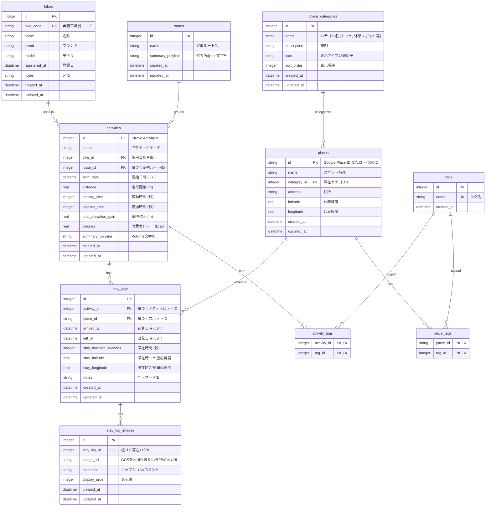

# テーブルスキーマ定義書 (DATABASE_SCHEMA)

## 1. 概要

本ドキュメントは、「**bicycle-log**」におけるデータベース（SQLite）のテーブル構造、リレーションシップ、インデックス、およびデータ型を定義する。

- **データベース種類**: SQLite 3 (単一ファイル `app.db`)
- **タイムゾーン方針**: 日時カラム（`DATETIME` 型）に保存する値はすべて日本標準時（JST, UTC+9 / ISO 8601 文字列 `YYYY-MM-DDTHH:MM:SS+09:00`）で扱う。
- **物理削除 / 論理削除**: マスタ参照整合性を保護するため、削除時は依存関係チェックを行い、制約がある場合は削除を拒否（HTTP 409 Conflict）してデータベース破損および不整合を保護する。

---

## 2. ER図 (Entity Relationship Diagram)



---

## 3. テーブル定義詳細

### 3.1 自転車マスタ (`bikes`)

所有する自転車情報を管理するマスタテーブル。

| カラム名 | 論理名 | データ型 | 制約 | 説明 |
| :--- | :--- | :--- | :--- | :--- |
| `id` | ID | INTEGER | PRIMARY KEY AUTOINCREMENT | 一意識別子 |
| `bike_code` | 自転車識別コード | TEXT | UNIQUE NOT NULL | 一意の識別コード（例: `BIKE-01`） |
| `name` | 名称 | TEXT | NOT NULL | 例: メインロードバイク |
| `brand` | ブランド | TEXT | NULLABLE | 例: Specialized, Trek |
| `model` | モデル | TEXT | NULLABLE | 例: Tarmac SL7 |
| `registered_at` | 登録日 | DATETIME | NULLABLE | 自転車登録日 |
| `notes` | 備考/メモ | TEXT | NULLABLE | コンポ仕様やメモ |
| `created_at` | 作成日時 | DATETIME | NOT NULL DEFAULT CURRENT_TIMESTAMP | JSTタイムスタンプ |
| `updated_at` | 更新日時 | DATETIME | NOT NULL DEFAULT CURRENT_TIMESTAMP | JSTタイムスタンプ |

---

### 3.2 滞在カテゴリマスタ (`place_categories`)

スポットの分類情報を管理するマスタテーブル。

| カラム名 | 論理名 | データ型 | 制約 | 説明 |
| :--- | :--- | :--- | :--- | :--- |
| `id` | ID | INTEGER | PRIMARY KEY AUTOINCREMENT | 一意識別子 |
| `name` | カテゴリ名 | TEXT | UNIQUE NOT NULL | 例: カフェ、休憩スポット、レストラン、公園、コンビニ等 |
| `description` | 説明 | TEXT | NULLABLE | カテゴリの概要説明 |
| `icon` | アイコン識別キー | TEXT | NULLABLE | UIおよびマップマーカーのアイコン名 |
| `sort_order` | 表示順序 | INTEGER | NOT NULL DEFAULT 100 | カテゴリ並び順 |
| `created_at` | 作成日時 | DATETIME | NOT NULL DEFAULT CURRENT_TIMESTAMP | JSTタイムスタンプ |
| `updated_at` | 更新日時 | DATETIME | NOT NULL DEFAULT CURRENT_TIMESTAMP | JSTタイムスタンプ |

---

### 3.3 定番ルートマスタ (`routes`)

幾何学的類似度 70% 以上の走行アクティビティをグループ化した定番ルートテーブル。

| カラム名 | 論理名 | データ型 | 制約 | 説明 |
| :--- | :--- | :--- | :--- | :--- |
| `id` | ルートID | INTEGER | PRIMARY KEY AUTOINCREMENT | 一意識別子 |
| `name` | ルート名称 | TEXT | NOT NULL | 例: 定番ルート #1 |
| `summary_polyline` | 代表Polyline文字列 | TEXT | NULLABLE | 代表的なルート描画用エンコードPolyline |
| `created_at` | 作成日時 | DATETIME | NOT NULL DEFAULT CURRENT_TIMESTAMP | JSTタイムスタンプ |
| `updated_at` | 更新日時 | DATETIME | NOT NULL DEFAULT CURRENT_TIMESTAMP | JSTタイムスタンプ |

---

### 3.4 スポットマスタ (`places`)

立ち寄り地点（滞在スポット）を管理するテーブル。

| カラム名 | 論理名 | データ型 | 制約 | 説明 |
| :--- | :--- | :--- | :--- | :--- |
| `id` | スポットID | TEXT | PRIMARY KEY | Google Place ID または 一意のID |
| `name` | スポット名称 | TEXT | NOT NULL | 例: XXカフェ、OO道の駅 |
| `category_id` | カテゴリID | INTEGER | NULLABLE, FK(`place_categories.id`) | 該当するカテゴリID |
| `address` | 住所 | TEXT | NULLABLE | 所在地住所 |
| `latitude` | 代表緯度 | REAL | NOT NULL | スポット代表座標（緯度） |
| `longitude` | 代表経度 | REAL | NOT NULL | スポット代表座標（経度） |
| `comment` | コメント | TEXT | NULLABLE | スポットに関するユーザーコメント・メモ |
| `created_at` | 作成日時 | DATETIME | NOT NULL DEFAULT CURRENT_TIMESTAMP | JSTタイムスタンプ |
| `updated_at` | 更新日時 | DATETIME | NOT NULL DEFAULT CURRENT_TIMESTAMP | JSTタイムスタンプ |

---

### 3.5 Stravaアクティビティ (`activities`)

Strava から同期した走行アクティビティを管理するテーブル。

| カラム名 | 論理名 | データ型 | 制約 | 説明 |
| :--- | :--- | :--- | :--- | :--- |
| `id` | アクティビティID | INTEGER | PRIMARY KEY | Strava Activity ID |
| `name` | アクティビティ名 | TEXT | NOT NULL | 例: 週末ロングライド |
| `bike_id` | 使用自転車ID | INTEGER | NULLABLE, FK(`bikes.id`) | 使用した自転車ID |
| `route_id` | 定番ルートID | INTEGER | NULLABLE, FK(`routes.id`) | 紐づく定番ルートID |
| `start_date` | 開始日時 | DATETIME | NOT NULL | ライド開始日時 (JST) |
| `distance` | 走行距離（m） | REAL | NOT NULL DEFAULT 0.0 | 走行距離 |
| `moving_time` | 移動時間（秒） | INTEGER | NULLABLE | 移動所要時間 |
| `elapsed_time` | 経過時間（秒） | INTEGER | NULLABLE | トータル経過時間 |
| `total_elevation_gain` | 獲得標高（m） | REAL | NOT NULL DEFAULT 0.0 | 総上昇量 |
| `calories` | 消費カロリー | REAL | NULLABLE | 消費カロリー (kcal) |
| `summary_polyline` | Polyline文字列 | TEXT | NULLABLE | 地図描画用エンコードPolyline |
| `created_at` | 作成日時 | DATETIME | NOT NULL DEFAULT CURRENT_TIMESTAMP | JSTタイムスタンプ |
| `updated_at` | 更新日時 | DATETIME | NOT NULL DEFAULT CURRENT_TIMESTAMP | JSTタイムスタンプ |

---

### 3.6 滞在ログ（訪問履歴） (`stay_logs`)

自動検出した30分以上の滞在地点・訪問記録を記録するテーブル。

| カラム名 | 論理名 | データ型 | 制約 | 説明 |
| :--- | :--- | :--- | :--- | :--- |
| `id` | 滞在ログID | INTEGER | PRIMARY KEY AUTOINCREMENT | 一意識別子 |
| `activity_id` | アクティビティID | INTEGER | NOT NULL, FK(`activities.id`) | 対象 Strava アクティビティ |
| `place_id` | スポットID | TEXT | NOT NULL, FK(`places.id`) | 訪問先スポットID |
| `arrived_at` | 到着日時 | DATETIME | NOT NULL | 到着時刻 (JST) |
| `left_at` | 出発日時 | DATETIME | NOT NULL | 出発時刻 (JST) |
| `stay_duration_seconds` | 滞在時間（秒） | INTEGER | NOT NULL | 滞在した合計秒数 (>=1800秒) |
| `stay_latitude` | 滞在GPS重心緯度 | REAL | NOT NULL | 当該滞在時のGPS平均緯度 |
| `stay_longitude` | 滞在GPS重心経度 | REAL | NOT NULL | 当該滞在時のGPS平均経度 |
| `notes` | ユーザー備考 | TEXT | NULLABLE | 個別メモ |
| `created_at` | 作成日時 | DATETIME | NOT NULL DEFAULT CURRENT_TIMESTAMP | JSTタイムスタンプ |
| `updated_at` | 更新日時 | DATETIME | NOT NULL DEFAULT CURRENT_TIMESTAMP | JSTタイムスタンプ |

---

### 3.7 滞在ログ添付画像 (`stay_log_images`)

滞在記録に紐づく複数写真およびコメントを管理するテーブル。

| カラム名 | 論理名 | データ型 | 制約 | 説明 |
| :--- | :--- | :--- | :--- | :--- |
| `id` | 画像ID | INTEGER | PRIMARY KEY AUTOINCREMENT | 一意識別子 |
| `stay_log_id` | 滞在ログID | INTEGER | NOT NULL, FK(`stay_logs.id`) | 紐づく滞在ログID |
| `image_url` | 画像URL | TEXT | NOT NULL | GCS WebP画像参照URL または 外部Web URL |
| `comment` | 画像コメント | TEXT | NULLABLE | 画像のキャプション・コメント |
| `display_order` | 表示順 | INTEGER | NOT NULL DEFAULT 1 | ギャラリー表示順 (1, 2, 3...) |
| `created_at` | 作成日時 | DATETIME | NOT NULL DEFAULT CURRENT_TIMESTAMP | JSTタイムスタンプ |
| `updated_at` | 更新日時 | DATETIME | NOT NULL DEFAULT CURRENT_TIMESTAMP | JSTタイムスタンプ |

---

### 3.8 タグマスタおよび紐付けテーブル (`tags`, `activity_tags`, `place_tags`)

アクティビティや滞在スポットに付与するカスタムタグ情報を管理するテーブル。

#### タグマスタ (`tags`)
| カラム名 | 論理名 | データ型 | 制約 | 説明 |
| :--- | :--- | :--- | :--- | :--- |
| `id` | タグID | INTEGER | PRIMARY KEY AUTOINCREMENT | 一意識別子 |
| `name` | タグ名 | TEXT | UNIQUE NOT NULL | 例: ヒルクライム, グルメライド |
| `created_at` | 作成日時 | DATETIME | NOT NULL DEFAULT CURRENT_TIMESTAMP | JSTタイムスタンプ |

#### アクティビティタグ紐付け (`activity_tags`)
| カラム名 | 論理名 | データ型 | 制約 | 説明 |
| :--- | :--- | :--- | :--- | :--- |
| `activity_id` | アクティビティID | INTEGER | NOT NULL, FK(`activities.id`) | 対象アクティビティID |
| `tag_id` | タグID | INTEGER | NOT NULL, FK(`tags.id`) | 紐づくタグID |

#### スポットタグ紐付け (`place_tags`)
| カラム名 | 論理名 | データ型 | 制約 | 説明 |
| :--- | :--- | :--- | :--- | :--- |
| `place_id` | スポットID | TEXT | NOT NULL, FK(`places.id`) | 対象スポットID |
| `tag_id` | タグID | INTEGER | NOT NULL, FK(`tags.id`) | 紐づくタグID |

---

## 4. 訪問統計用ビュー (`place_visit_summaries`)

スポットごとの訪問回数・累計滞在時間・最終訪問日時を集計するビュー。

```sql
CREATE VIEW IF NOT EXISTS place_visit_summaries AS
SELECT 
    p.id AS place_id,
    p.name AS place_name,
    p.category_id,
    c.name AS category_name,
    p.address,
    p.latitude,
    p.longitude,
    COUNT(s.id) AS visit_count,
    SUM(s.stay_duration_seconds) AS total_stay_seconds,
    MAX(s.arrived_at) AS last_visited_at
FROM places p
LEFT JOIN place_categories c ON p.category_id = c.id
JOIN stay_logs s ON p.id = s.place_id
GROUP BY p.id;
```

---

## 5. インデックス設計

検索の高速化およびリレーション結合操作の最適化のため、以下のインデックスを作成する。

```sql
-- 自転車・アクティビティ結合・日付ソート用インデックス
CREATE INDEX idx_activities_bike_id ON activities(bike_id);
CREATE INDEX idx_activities_route_id ON activities(route_id);
CREATE INDEX idx_activities_start_date ON activities(start_date);

-- スポット座標・カテゴリ結合用インデックス
CREATE INDEX idx_places_category_id ON places(category_id);
CREATE INDEX idx_places_lat_lng ON places(latitude, longitude);

-- 滞在ログ結合・検索用インデックス
CREATE INDEX idx_stay_logs_activity_id ON stay_logs(activity_id);
CREATE INDEX idx_stay_logs_place_id ON stay_logs(place_id);
CREATE INDEX idx_stay_logs_arrived_at ON stay_logs(arrived_at);

-- 滞在ログ画像結合用インデックス
CREATE INDEX idx_stay_log_images_stay_log_id ON stay_log_images(stay_log_id);
```

---

## 6. 初期投入データ（シードデータ）

### 6.1 滞在カテゴリマスタ (`place_categories`)
1. `宿泊施設` (`icon`: `hotel`, `sort_order`: 10)
2. `カフェ` (`icon`: `coffee`, `sort_order`: 20)
3. `レストラン` (`icon`: `utensils`, `sort_order`: 30)
4. `コンビニ` (`icon`: `store`, `sort_order`: 40)
5. `公園` (`icon`: `trees`, `sort_order`: 50)
6. `映画館` (`icon`: `film`, `sort_order`: 60)
7. `博物館・美術館` (`icon`: `landmark`, `sort_order`: 70)
8. `寺社・仏閣` (`icon`: `church`, `sort_order`: 80)
9. `駅` (`icon`: `train`, `sort_order`: 90)
10. `休憩スポット` (`icon`: `coffee`, `sort_order`: 100)
11. `その他` (`icon`: `map-pin`, `sort_order`: 110)

---

## 7. 改定履歴

| バージョン | 改定日 | 改訂依頼番号 | 改定内容 |
| :--- | :--- | :--- | :--- |
| 1.1 | 2026-09-02 | 1.1.001 | `places` テーブルに `comment`（ユーザーコメント・メモ、TEXT, NULLABLE）カラムを追加 |

