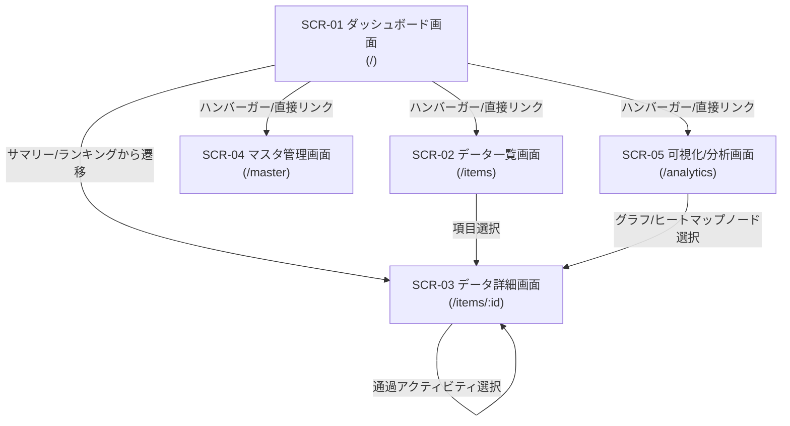

# 画面仕様書 (SCREEN_SPECIFICATIONS)

## 1. 概要

本ドキュメントは、「**bicycle-log**」における画面レイアウト、UI/UXデザイン仕様、インタラクション、画面遷移、および各種表示コンポーネントの挙動を定義する。

---

## 2. 画面一覧および画面遷移図

### 2.1 画面一覧

| 画面ID | 画面名称 | ルーティングパス | 主な機能 |
| :--- | :--- | :--- | :--- |
| `SCR-01` | ダッシュボード画面 | `/` | システム主要サマリー表示（走行距離/上昇量/ライド数/滞在スポット数）、直近アクティビティ、滞在記録ランキング上位10件 |
| `SCR-02` | データ一覧画面 | `/items` | アクティビティ一覧 / 滞在スポット一覧のページング表示、リアルタイムあいまい検索、各種フィルター |
| `SCR-03` | データ詳細画面 | `/items/:id` | アクティビティ・滞在スポット詳細表示、Google Maps表示、通過アクティビティ一覧、複数写真・コメントギャラリー |
| `SCR-04` | マスタ管理画面 | `/master` | 自転車マスタ (`bikes`)、滞在カテゴリマスタ (`place_categories`)、タグマスタの登録・編集・削除マスタメンテナンス |
| `SCR-05` | 可視化/分析画面 | `/analytics` | Bike ID別アクティビティメトリクス可視化（距離/上昇量/時間/回数/カロリー）、タイムレンジ切替（年間/月間/週間）、Polylineヒートマップ |

### 2.2 画面遷移図

---

## 3. 共通 UI/UX ・レスポンシブ・テーマ仕様

### 3.1 デバイス別ブレークポイントおよびレイアウト枠構造 (Tailwind CSS)

- **モバイル表示（スマートフォン・狭画面端末）**: 画面幅 `767px` 以下（Tailwind CSS の `md:` 未満）
  - メイン領域は単一カラム縦スクロール構造。
  - テーブル表示はカード型レイアウトへ自動変換。
- **デスクトップ表示（PC・タブレット広画面）**: 画面幅 `768px` 以上
  - メインコンテナの最大幅を **`1800px`** に設定 (`max-w-[1800px] mx-auto px-6`)。
  - メインコンテナやグリッド一覧、地図領域を画面幅いっぱいに活用したレイアウト。

### 3.2 トップバー & ハンバーガーメニュー方式

- **トップバー構成**:
  - 画面左上: アプリケーションタイトルロゴ（「**bicycle-log**」）
  - 画面右上: ハンバーガーメニューアイコンボタン（`Lucide React: Menu`）
- **ハンバーガーメニュー仕様**:
  - クリック時、画面右側からスライドインオーバーレイ（ドロワー）表示。
  - **ナビゲーションリンク集**:
    - 🏠 ダッシュボード (`/`)
    - 📁 データ一覧 (`/items`)
    - 📊 可視化/分析 (`/analytics`)
    - ⚙️ マスタ管理 (`/master`)
  - **区切り線**: 下部に水平線を配置。
  - **最下部コントロール領域**:
    - **表示モード設定**: 「ライト」「ダーク」「システム (OS追従)」の切り替えボタン（`Sun`, `Moon`, `Monitor` アイコン）。
    - **ユーザー識別表示**: Cloud Run IAP から取得したログインユーザーのメールアドレス (`x-goog-authenticated-user-email`) を表示。
    - **ログアウトボタン**: Google IAP 認証セッション解除ボタン。

### 3.3 テーマデザイン仕様（マルチテーマ: ライト／ダーク／システム追従）

- **表示モード**:
  - **ライト (Light)**: 明るく清潔感のあるスタイリング (`bg-slate-50`, `bg-white`, 文字色 `text-slate-900`)
  - **ダーク (Dark)**: 落ち着いた洗練されたダークスタイリング (`dark:bg-slate-900`, `dark:bg-slate-800`, 文字色 `dark:text-slate-100`)
  - **システム (System)**: OSのダークモード設定 (`prefers-color-scheme: dark`) にリアルタイム連動

### 3.4 ボタン類のミニマルアイコン化および英語表記ルール

- **ボタンデザインルール**:
  - 操作が明確なアクションボタンはテキストを排除し、**Lucide React アイコンのみのミニマル表示**とする。
  - **ツールチップ (Tooltip / `title` 属性)**: すべて英語表記で統一する。
- **ボタン・アイコン対応一覧**:

| アクション | アイコン (Lucide React) | 英語Tooltip (`title`) | デザインスタイル |
| :--- | :--- | :--- | :--- |
| 編集 | `Pencil` | `Edit` | インディゴ/ブルー枠 |
| 削除 | `Trash2` | `Delete` | ローズ/レッド枠 |
| 検索 | `Search` | `Search` | スレート/ネイビー枠 |
| 新規追加 | `Plus` | `Add New` | エメラルド/グリーン枠 |
| 閉じる | `X` | `Close` | スレート無地 |
| 保存 | `Check` / `Save` | `Save Changes` | エメラルド塗りつぶし |
| フィルター | `Filter` | `Filter` | スレート枠 |
| 詳細表示 | `Eye` / `ExternalLink` | `View Details` | スレート/ネイビー枠 |
| Strava同期 | `RefreshCw` | `Sync Strava` | オレンジ/サフラン枠 |
| 定番ルート検出 | `Route` / `GitMerge` | `Detect Routes` | パープル/バイオレット枠 |
| 画像選択 | `Image` / `Folder` | `Select Image` | スレート/インディゴ枠 |

---

## 4. 画面別詳細仕様

### 4.1 ダッシュボード画面 (`SCR-01`)

トップページとして、アクティビティと滞在記録の主要サマリー、直近のアクティビティ、および滞在記録ランキングを表示する画面。

- **構成要素**:
  1. **主要サマリーカードエリア**:
     - 総走行距離 (km)、総上昇量 (m)、総ライド回数 (回)、累積滞在スポット数 (箇所) を表示。
  2. **直近アクティビティパネル**:
     - 直近に自動取得・記録された Strava アクティビティ概要（日時、名前、使用 Bike、距離、獲得標高）。
  3. **滞在記録ランキングパネル**:
     - 訪問回数の多い上位 10 件の滞在スポット（Place 名、カテゴリ、訪問回数、最終訪問日時）を表示。
     - 各行クリックでデータ詳細画面 (`SCR-03`) へ遷移。

---

### 4.2 データ一覧画面 (`SCR-02`)

アクティビティおよび滞在スポットを検索・フィルター・確認・手動登録する画面。

- **構成要素**:
  1. **タブ切り替えコントロール**:
     - 「アクティビティ一覧」／「滞在スポット一覧」の表示切り替えタブ。
  2. **検索・フィルターバー**:
     - リアルタイムあいまい検索キーワード入力フィールド（名称、概要、住所、カテゴリ、備考等）。
     - カテゴリ／Bike ID ドロップダウンフィルター。
     - Strava同期ボタン (`Sync Strava`)、定番ルート検出ボタン (`Detect Routes`) および 新規作成ボタン (`Add New`)。
  3. **一覧データ表示領域**:
     - **デスクトップ**: テーブル形式（サムネイル、名称/日時、カテゴリ/使用Bike、距離/滞在時間、アクションボタン）。
     - **モバイル**: カード型グリッド形式。
  4. **ページネーションコントローラー**:
     - ページ表示件数切り替え、前後移動、ページ番号。

---

### 4.3 データ詳細画面 (`SCR-03`)

アクティビティまたは滞在スポットの全メタデータ、地図表示、ギャラリーを管理する画面。

- **構成要素**:
  1. **メタデータ & マップ表示エリア**:
     - Google Maps / Leaflet 上に滞在スポットマーカーおよびアクティビティ Polyline を描画。
     - **名称のクリック編集**: アクティビティおよび滞在スポットの名称をクリックしてインライン編集・保存が可能。
     - **スポットコメント機能**: 滞在スポット詳細時にコメント欄を表示。クリックしてコメントの入力・編集が可能。
     - スポットカテゴリ、住所、代表座標、Google Maps Place 詳細リンクを表示。
  2. **通過アクティビティ・滞在ログ一覧パネル**:
     - **アクティビティ詳細時**: 走行中の滞在ログ一覧を表示（※住所情報は非表示化し、到着時刻・滞在時間・写真をシンプルに表示）。
     - **滞在スポット詳細時**: 該当スポットを通過・訪問した過去のアクティビティ一覧を表示。
  3. **複数写真・コメントギャラリーエリア**:
     - 各滞在ログに紐づく添付写真一覧を表示（WebP 80% 正方形サムネイル）。
     - **写真詳細モーダル**: 写真クリック時の拡大表示モーダル内で、コメント欄をクリックしてコメントのインライン編集・保存が可能。

---

### 4.4 可視化/分析画面 (`SCR-05`)

走行データおよびルート軌跡を動的グラフおよびヒートマップで可視化する画面。

- **構成要素**:
  1. **タイムレンジ切替ヘッダー**:
     - 「年間」「月間」「週間」切り替えボタン。
     - Bike ID 選択フィルター。
  2. **メトリクス集計グラフエリア**:
     - 走行距離、総上昇量、総時間、ライド回数、消費カロリーを Bike 別にグラフ表示。
  3. **Polyline ヒートマップエリア**:
     - Strava 走行軌跡を Leaflet 上にヒートマップ描画。
     - **スポット表示トグル制御**: 「スポット表示」チェックボックス変更時、地図の拡大・縮小スケールや表示中心位置を保持（リセット防止）。
     - 定番ルートの優先統合表示（配下アクティビティ数表示）と、クリック時の通過アクティビティ重ね合わせ描画 & Strava ライド詳細リンク。

---

### 4.5 マスタ管理画面 (`SCR-04`)

自転車マスタ (`bikes`)、滞在カテゴリマスタ (`place_categories`)、定番ルートマスタ (`routes`) 等をメンテナンスする画面。

- **構成要素**:
  1. **マスタ種別切り替えタブ**:
     - 「自転車マスタ (`bikes`)」／「滞在カテゴリマスタ (`place_categories`)」／「定番ルートマスタ (`routes`)」／「タグマスタ」切り替え。
  2. **定番ルートマスタタブ仕様**:
     - 定番ルート一覧表示（ルートID、ルート名称、代表 Polyline プレビュー、配下アクティビティ件数）。
     - ルート名の編集モーダル (`Edit`)、手動一括検出ボタン (`Detect Routes`)。
  3. **マスタデータグリッド/テーブル**:
     - 項目一覧、編集ボタン (`Edit`)、削除ボタン (`Delete`)。
     - 子レコード参照時の物理削除防止保護（409 Conflict 時のエラーダイアログ表示）。

---

## 5. 改定履歴

| バージョン | 改定日 | 改訂依頼番号 | 改定内容 |
| :--- | :--- | :--- | :--- |
| 1.1 | 2026-09-02 | 1.1.001 | 滞在スポット名称・コメントのインライン編集機能、写真拡大モーダルのコメント編集機能、アクティビティ滞在ログの住所非表示化、Analyticsヒートマップのスポット切替時スケール保持機能を追加 |
